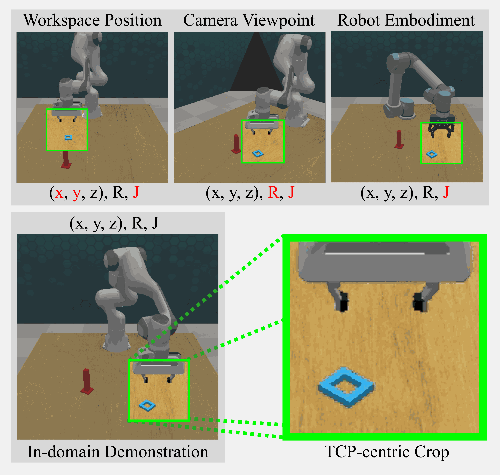

# PALM

Official code release for the R-AL 2026 paper **PALM: Enhanced Generalizability for Local Visuomotor Policies via Perception Alignment**.

Paper: [arXiv](https://arxiv.org/abs/2601.19514)

<p align="center">
  
</p>

## Overview

PALM is a modular manipulation framework for improving the robustness of visuomotor policies under out-of-distribution (OOD) shifts, including workspace position changes, camera viewpoint changes, and robot embodiment transfer.

PALM builds on the observation that local action distributions remain invariant between demonstrated and OOD domains, while observation states may change substantially. It aligns the inputs to the local policy by enforcing local visual focus and consistent proprioceptive representations, enabling the policy to retrieve invariant local actions under OOD conditions.

PALM acts as a data preprocessing method and improves model generalization without requiring extra sensors, model architecture changes, or additional data collection.

## Repository Layout

The main package is `palm`, which contains:

```text
palm/
├── configs/          # Dataset and training configs
├── data/             # RLBench demo collection and HDF5 conversion
├── evaluation/       # RLBench rollout evaluation and OOD setup
├── models/           # BCMLP policy and network modules
├── training/         # Policy training loop
├── utils/            # Camera, transform, config, logging, and image utilities
asset
```

## Installation

### Prerequisites

PALM uses RLBench, PyRep, and CoppeliaSim. Before installation, make sure the following dependencies are available:

* Conda or Miniconda
* CoppeliaSim 4.1
* CUDA-compatible PyTorch installation, if using GPU training
* Local checkouts of `pyrep` and `rlbench`, or permission for the setup script to clone them

### Automatic Setup

The recommended setup path is the bootstrap script:

```bash
./setup_training_env.sh
```

The script creates a conda environment, applies dependency patches, installs PyRep, RLBench, and PALM in editable mode, builds the PyRep CFFI extension, sets CoppeliaSim runtime variables, and downloads background assets.

If CoppeliaSim is not found automatically, specify its path:

```bash
COPPELIASIM_ROOT=/path/to/CoppeliaSim_Edu_V4_1_0_Ubuntu20_04 ./setup_training_env.sh
```

Useful setup options:

```bash
# Use a custom conda environment name
ENV_NAME=palm ./setup_training_env.sh

# Recreate the conda environment from scratch
RESET_ENV=1 ENV_NAME=palm ./setup_training_env.sh

# Use a custom PyTorch index
TORCH_INDEX_URL=https://download.pytorch.org/whl/cu121 ./setup_training_env.sh

# Use custom PyTorch versions
TORCH_PACKAGES="torch==2.5.1 torchvision==0.20.1" ./setup_training_env.sh

# Reset tracked PyRep/RLBench files before applying patches
RESET_PATCH_TARGETS=1 ./setup_training_env.sh
```

By default, the script installs CUDA 12.1 PyTorch wheels:

```text
torch==2.5.1
torchvision==0.20.1
```

### Manual Installation

If you already have a compatible environment, install the dependencies manually:

```bash
pip install -e ../pyrep
pip install -e ../rlbench
pip install -e .
```

To apply PALM's dependency patches:

```bash
./patch_manager.sh apply
```

## Configs

Dataset conversion configs are located in:

```text
palm/configs/dataset/
```

Available task configs include:

```text
insert_peg_config.json
lift_lid_config.json
lift_spam_config.json
rearrange_veges_config.json
```

Training configs are located in:

```text
palm/configs/train/
```

Each task provides a PALM config and a baseline config, for example:

```text
lift_spam_config.json
lift_spam_baseline_config.json
```

## Data Collection and Conversion

To collect RLBench demonstrations and convert them to the PALM HDF5 format:

```bash
palm-collect -f dataset/lift_spam_config
```

To convert an existing collected dataset without recollecting demonstrations:

```bash
palm-collect -f dataset/lift_spam_config --convert_only
```

## Training

Train a PALM local policy:

```bash
palm-train -c palm/configs/train/lift_spam_config.json
```

Train the corresponding baseline local policy:

```bash
palm-train -c palm/configs/train/lift_spam_baseline_config.json
```

Training outputs are saved under the experiment directory specified in the config.

## Evaluation

Evaluate a trained checkpoint:

```bash
palm-eval -m ../experiments/lift_spam/palm/best.ckpt.tar
```

Evaluate under OOD workspace, camera, and robot embodiment shifts:

```bash
palm-eval \
  -m ../experiments/lift_spam/palm/best.ckpt.tar \
  --workspace \
  --camera_mode mild \
  --align_cam \
  --robot ur5
```

For PALM local policies evaluated under camera rotations, use:

```bash
--align_cam
```

A meta policy is applied by default for workspace and camera OOD evaluation.

## Reproducing Results

A typical reproduction pipeline is:

```bash
# 1. Collect demonstrations and convert to HDF5
palm-collect -f dataset/lift_spam_config

# 2. Train PALM
palm-train -c palm/configs/train/lift_spam_config.json

# 3. Evaluate PALM under OOD conditions
palm-eval \
  -m ../experiments/lift_spam/palm/best.ckpt.tar \
  --workspace \
  --camera_mode mild \
  --align_cam \
  --robot ur5
```

Repeat the same process with the corresponding baseline config to train and evaluate the baseline policy.

## Acknowledgements

This codebase builds on [RLBench](https://github.com/stepjam/RLBench) and [PyRep](https://github.com/stepjam/PyRep). We thank the authors for making these tools publicly available.

PALM includes targeted patches to RLBench and PyRep for the four manipulation tasks studied in the paper. These patches support improved waypoint generation for demonstration collection, gripper actuation, grasp-condition handling, and a UR5 `.ttt` model for cross-embodiment evaluation.

## License

This project is released under the [MIT License](LICENSE).

## Citation

If you find this repository useful, please cite:

```bibtex
@article{palm2026,
  title   = {PALM: Enhanced Generalizability for Local Visuomotor Policies via Perception Alignment},
  author  = {Wang, Ruiyu and Zhuang, Zheyu and Kragic, Danica and Pokorny, Florian T.},  
  journal = {IEEE Robotics and Automation Letters},
  year    = {2026}
}
```
